# Dynamic Attack Graph Generation Based on Threat Data

An automated pipeline that generates risk-scored attack graphs from environment descriptions. It combines live threat intelligence, vulnerability correlation, and MulVAL based attack graph reasoning into a single Docker driven workflow.

---

## Pipeline Architecture



### 1. Threat Intelligence Ingestion *(optional)*

Synchronizes vulnerability data from authoritative sources into PostgreSQL:

- **NVD CVEs** — CVSS scores and CPE mappings via VulnCheck API
- **EPSS Scores** — Exploit prediction scores from FIRST.org
- **KEV Catalog** — CISA's Known Exploited Vulnerabilities via VulnCheck API

Only needed when refreshing the threat intelligence database. Skip this step to reuse existing data.

### 2. Environment Correlation

Correlates network assets with threat intelligence to produce a MulVAL-ready Prolog scenario file:

- Maps asset CPE identifiers to CVEs from the database
- Generates `vulExists()` and `vulProperty()` Prolog facts
- Optionally integrates a **STRIDE threat model** (`stride_definition.json`) to inject additional attack facts
- Outputs an enriched `scenario.P` file, archiving the previous version

**Inputs:**
- `scenario*.P` — base MulVAL scenario (network topology, connectivity, attack goals)
- `asset_cpe_mapping.json` — maps each asset/service to its CPE identifier
- `stride_definition.json` *(optional)* — STRIDE threat definitions per asset

### 3. Orchestrator

Manages MulVAL execution with change detection to avoid redundant computation:

- Compares `vulExists` and `attackGoal` statements between old and new scenario files
- Skips regeneration if nothing meaningful changed
- Triggers MulVAL when changes are detected (or `--force` is passed)

### 4. Post-Processing

Enriches the raw MulVAL output with threat intelligence and produces a risk report:

- Parses `VERTICES.CSV` / `ARCS.CSV` into an AND/OR graph model
- Enriches vulnerability nodes with CVSS, EPSS, and KEV data
- Computes **path-level risk scores** using:
  - EPSS exploitation probability × CVSS severity
  - CIA triad multiplier (configurable weights)
  - 1.5x multiplier for CISA KEV entries
  - Asset criticality and path directness
- Performs **delta analysis** against the previous snapshot to surface emerging threats
- Renders color-coded annotated attack graphs (PDF/PNG)
- Includes a graph caption by default, with `--no-caption` available for compact visualizations

---

## MulVAL

MulVAL is a logic-based attack graph engine. It takes a **Prolog facts file** describing your network (`input.P`) and applies **attack rules** to derive all possible attack paths.

If you need to create or edit the MulVAL input file used by this pipeline (`scenario.P` / `input.P`), see [MULVAL_PROLOG_GUIDE.md](MULVAL_PROLOG_GUIDE.md) for the required facts and modeling conventions.

**Key facts in `input.P`:**
- `networkServiceInfo` — services running on hosts
- `vulExists` / `vulProperty` — known vulnerabilities and their properties
- `hacl` — host access control (network connectivity between hosts)
- `attackGoal` — what the attacker is trying to achieve

**Running MulVAL directly:**
```sh
graph_gen.sh input.P -v
# -l  output the attack-graph in .CSV format
# -v  output the attack-graph in .CSV and .PDF format
# -g "execCode(host,_)"  : limit to paths reaching a specific goal
```

**Attack graph node types:**

| Shape | Meaning |
|-------|---------|
| Rectangle | Input fact (from your scenario file) |
| Diamond | AND node — all incoming conditions must hold |
| Oval | OR node — attacker capability; any one path suffices |

In this pipeline, MulVAL is invoked automatically by the Orchestrator. The `scenario.P` produced by the Environment Correlation layer is the input.

---

## Running the Pipeline

### Prerequisites

- Docker and Docker Compose
- A `.env` file with database credentials (see `.env.example`)
- Test case files in `test_cases/<SCENARIO>/enviroment/`

### Commands

```sh
# Run without threat intelligence ingestion (uses existing DB data)
make run

# Run WITH threat intelligence ingestion (refreshes CVE/EPSS/KEV data)
make ingest

# Select a different test case (default: scenario1)
make run SCENARIO=scenario2
```

### Test Case Structure

```
test_cases/<SCENARIO>/
├── enviroment/
│   ├── scenario*.P             # Base MulVAL scenario
│   ├── asset_cpe_mapping.json  # Asset -> CPE mappings
│   └── stride_definition.json  # (optional) STRIDE threats
├── gen_graph/                  # MulVAL output (generated)
└── post_processing/            # Risk reports and annotated graphs (generated)
```
