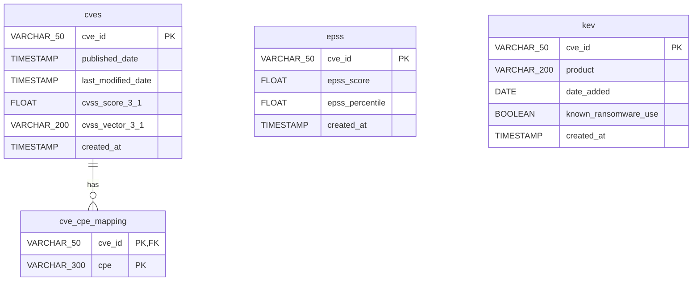

# Threat Intelligence Database Logical Model

```mermaid
erDiagram
    cves {
        VARCHAR_50 cve_id PK
        TIMESTAMP published_date
        TIMESTAMP last_modified_date
        FLOAT cvss_score_3_1
        VARCHAR_200 cvss_vector_3_1
        TIMESTAMP created_at
    }

    cve_cpe_mapping {
        VARCHAR_50 cve_id PK, FK
        VARCHAR_300 cpe PK
    }

    epss {
        VARCHAR_50 cve_id PK
        FLOAT epss_score
        FLOAT epss_percentile
        TIMESTAMP created_at
    }

    kev {
        VARCHAR_50 cve_id PK
        VARCHAR_200 product
        DATE date_added
        BOOLEAN known_ransomware_use
        TIMESTAMP created_at
    }

    cves ||--o{ cve_cpe_mapping : "has"
```
