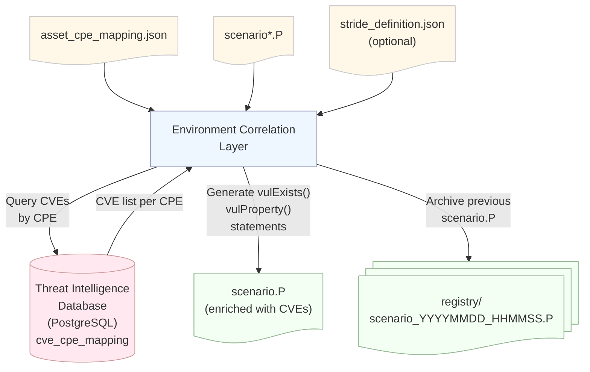

# Environment Correlation Overview

```mermaid
flowchart TB
    assetmap@{ shape: doc, label: "asset_cpe_mapping.json" }
    scenario_src@{ shape: doc, label: "scenario*.P" }
    stride@{ shape: doc, label: "stride_definition.json\n(optional)" }
    db[("Threat Intelligence\nDatabase\n(PostgreSQL)\ncve_cpe_mapping")]
    correlation["Environment Correlation\nLayer"]
    scenario_out@{ shape: doc, label: "scenario.P\n(enriched with CVEs)" }
    registry@{ shape: docs, label: "registry/\nscenario_YYYYMMDD_HHMMSS.P" }

    assetmap --> correlation
    scenario_src --> correlation
    stride --> correlation
    correlation -->|"Query CVEs\nby CPE"| db
    db -->|"CVE list per CPE"| correlation
    correlation -->|"Generate vulExists()\nvulProperty()\nstatements"| scenario_out
    correlation -->|"Archive previous\nscenario.P"| registry

    classDef artifact fill:#FFF7E8,stroke:#ccc,color:#333
    classDef processing fill:#EEF6FF,stroke:#99b,color:#333
    classDef output fill:#F4FFF4,stroke:#9b9,color:#333
    classDef database fill:#FFE8F0,stroke:#c99,color:#333

    class assetmap,scenario_src,stride artifact
    class correlation processing
    class scenario_out,registry output
    class db database
```
