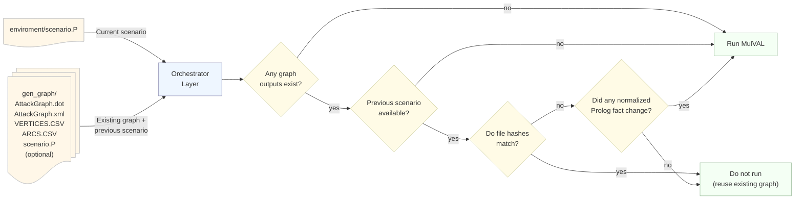

# Orchestrator Overview

```mermaid
flowchart LR
    scenario_in@{ shape: doc, label: "enviroment/scenario.P" }
    graph_cache@{ shape: docs, label: "gen_graph/\nAttackGraph.dot\nAttackGraph.xml\nVERTICES.CSV\nARCS.CSV\nscenario.P\n(optional)" }
    orchestrator["Orchestrator\nLayer"]

    q1{"Any graph\noutputs exist?"}
    q2{"Previous scenario\navailable?"}
    q3{"Do file hashes\nmatch?"}
    q4{"Did any normalized\nProlog fact change?"}
    run_mulval["Run MulVAL"]
    skip_mulval["Do not run\n(reuse existing graph)"]

    scenario_in -->|Current scenario| orchestrator
    graph_cache -->|"Existing graph +\nprevious scenario"| orchestrator

    orchestrator --> q1
    q1 -->|no| run_mulval
    q1 -->|yes| q2
    q2 -->|no| run_mulval
    q2 -->|yes| q3
    q3 -->|yes| skip_mulval
    q3 -->|no| q4
    q4 -->|yes| run_mulval
    q4 -->|no| skip_mulval

    classDef artifact fill:#FFF7E8,stroke:#ccc,color:#333
    classDef processing fill:#EEF6FF,stroke:#99b,color:#333
    classDef output fill:#F4FFF4,stroke:#9b9,color:#333
    classDef decision fill:#FFFBE6,stroke:#cc9,color:#333

    class scenario_in,graph_cache artifact
    class orchestrator processing
    class run_mulval,skip_mulval output
    class q1,q2,q3,q4 decision
```
