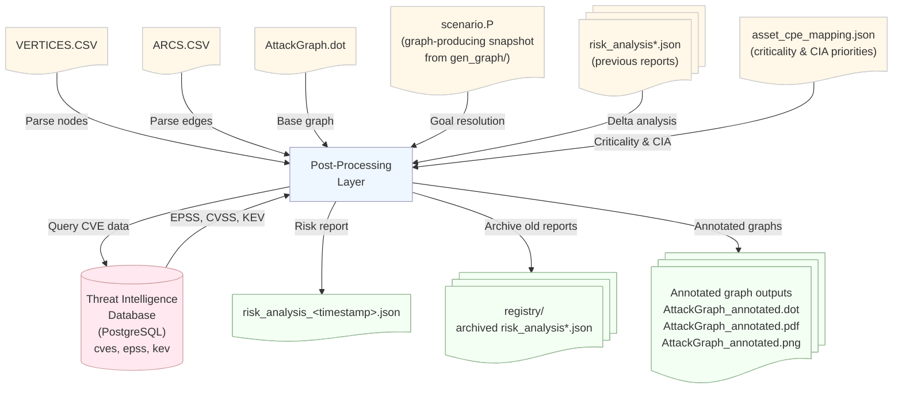

# Post-Processing Layer Overview

```mermaid
flowchart TB
    vertices@{ shape: doc, label: "VERTICES.CSV" }
    arcs@{ shape: doc, label: "ARCS.CSV" }
    attackdot@{ shape: doc, label: "AttackGraph.dot" }
    snapshot_scenario@{ shape: doc, label: "scenario.P\n(graph-producing snapshot\nfrom gen_graph/)" }
    previous_reports@{ shape: docs, label: "risk_analysis*.json\n(previous reports)" }
    db[("Threat Intelligence\nDatabase\n(PostgreSQL)\ncves, epss, kev")]
    asset_mapping@{ shape: doc, label: "asset_cpe_mapping.json\n(criticality & CIA priorities)" }

    postproc["Post-Processing\nLayer"]

    report_out@{ shape: doc, label: "risk_analysis_&lt;timestamp&gt;.json" }
    registry@{ shape: docs, label: "registry/\narchived risk_analysis*.json" }
    graph_outputs@{ shape: docs, label: "Annotated graph outputs\nAttackGraph_annotated.dot\nAttackGraph_annotated.pdf\nAttackGraph_annotated.png" }

    vertices -->|"Parse nodes"| postproc
    arcs -->|"Parse edges"| postproc
    attackdot -->|"Base graph"| postproc
    snapshot_scenario -->|"Goal resolution"| postproc
    previous_reports -->|"Delta analysis"| postproc
    asset_mapping -->|"Criticality & CIA"| postproc
    postproc -->|"Query CVE data"| db
    db -->|"EPSS, CVSS, KEV"| postproc

    postproc -->|"Risk report"| report_out
    postproc -->|"Archive old reports"| registry
    postproc -->|"Annotated graphs"| graph_outputs

    classDef artifact fill:#FFF7E8,stroke:#ccc,color:#333
    classDef processing fill:#EEF6FF,stroke:#99b,color:#333
    classDef output fill:#F4FFF4,stroke:#9b9,color:#333
    classDef database fill:#FFE8F0,stroke:#c99,color:#333

    class vertices,arcs,attackdot,snapshot_scenario,previous_reports,asset_mapping artifact
    class postproc processing
    class report_out,registry,graph_outputs output
    class db database
```
