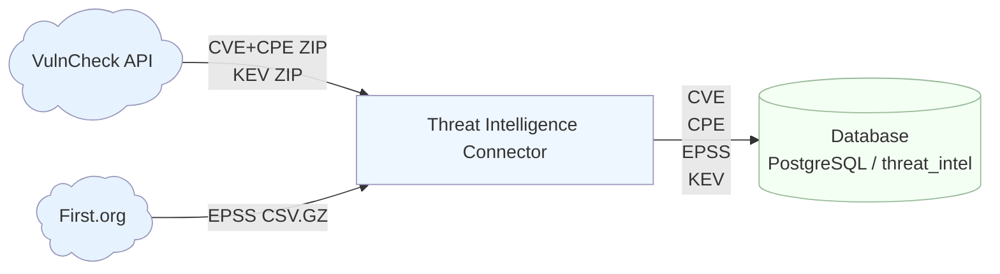

# Threat Intelligence Ingestion Overview

```mermaid
flowchart LR
    vulncheck@{ shape: cloud, label: "VulnCheck API" }
    firstorg@{ shape: cloud, label: "First.org" }
    connector["Threat Intelligence Connector"]
    db[("Database\nPostgreSQL / threat_intel")]

    vulncheck -->|"CVE+CPE ZIP\nKEV ZIP"| connector
    firstorg -->|"EPSS CSV.GZ"| connector
    connector -->|"CVE\nCPE\nEPSS\nKEV"| db

    classDef cloud fill:#E7F2FF,stroke:#99b,color:#333
    classDef processing fill:#EEF6FF,stroke:#99b,color:#333
    classDef output fill:#F4FFF4,stroke:#9b9,color:#333

    class vulncheck,firstorg cloud
    class connector processing
    class db output
```
