# Environment Correlation

Correlates network assets with threat intelligence and STRIDE threat models to generate MulVAL-compatible Prolog attack scenarios.

## Architecture



## What It Does

This service bridges asset configurations with vulnerability data:

- **CPE-to-CVE Mapping** - Queries threat intelligence database to find CVEs for each asset's CPE identifiers
- **Vulnerability Statement Generation** - Creates MulVAL Prolog `vulExists()` and `vulProperty()` facts
- **STRIDE Threat Integration** *(optional)* - Validates and maps STRIDE threat models into Prolog statements
- **Attack Scenario Generation** - Produces enriched Prolog files ready for MulVAL attack graph analysis

## How It Works

The service enriches MulVAL scenario files through automated injection:

1. **Load Inputs** - Reads source scenario file (`scenario*.P`) and asset CPE mappings (`asset_cpe_mapping.json`)
2. **CVE Correlation** - For each asset's CPEs, queries the database for associated CVEs and generates Prolog vulnerability statements
3. **STRIDE Mapping** *(optional)* - If `--stride-file` provided, validates STRIDE threats against scenario assets and generates additional Prolog facts
4. **Statement Injection** - Injects vulnerability statements after `/* configuration information of <asset_id> */` comments in the source
5. **Archive & Write** - Archives previous `scenario.P` to registry with timestamp, writes new enriched file

**File Registry**: Maintains rotating archive of last 10 scenario versions with UTC timestamps (e.g., `scenario_20260519_143022.P`)

### Architecture

- **EnviromentCorrelationController** - Orchestrates correlation and file generation
- **EnviromentCorrelationHandler** - Manages database queries and CVE-to-Prolog transformation
- **StrideHandler** - Validates STRIDE definitions and converts threats to Prolog facts
- **PostgresRepository** - Database operations with validated Pydantic schemas
- **Input Files**:
  - `scenario*.P` - Source MulVAL configuration (read-only)
  - `asset_cpe_mapping.json` - Asset-to-CPE mappings
  - `stride_definition.json` *(optional)* - STRIDE threat model

## Usage

```sh
poetry run python -m enviroment_correlation_layer \
    --config .config/config.toml \
    --work-dir ./test_case \
    --registry-dir ./test_case/registry
```

**With STRIDE threat model:**
```sh
poetry run python -m enviroment_correlation_layer \
    --config .config/config.toml \
    --work-dir ./test_case \
    --registry-dir ./test_case/registry \
    --stride-file ./test_case/stride_definition.json
```

Requires TOML configuration with database credentials. Outputs `work_dir/scenario.P` ready for MulVAL attack graph generation.

## Input Files

### asset_cpe_mapping.json
Maps assets to CPE identifiers:
```json
{
  "assets": [
    {
      "asset": "webServer",
      "services": [
        {
          "service_name": "httpd",
          "cpe": "cpe:2.3:a:apache:http_server:2.4.49:*:*:*:*:*:*:*"
        }
      ]
    }
  ]
}
```

### stride_definition.json *(optional)*
STRIDE threat model with validated assets and threats:
```json
{
  "system": "Enclave Network",
  "assets": [
    {
      "name": "webServer",
      "service": "nginx"
    }
  ],
  "threats": [
    {
      "id": "T1",
      "stride": "Elevation of Privilege",
      "asset": "webServer",
      "impact": "remote_code_execution",
      "description": "Web server exploitation threat",
      "mitre_attack": "T1190 - Exploit Public-Facing Application"
    }
  ]
}
```

**STRIDE Validation**:
- All STRIDE assets must exist in `asset_cpe_mapping.json` (case-insensitive)
- All threats must reference assets defined in STRIDE `assets` block
- Valid STRIDE categories: Spoofing, Tampering, Repudiation, Information Disclosure, Denial of Service, Elevation of Privilege

## Output

Generates `work_dir/scenario.P` with injected vulnerability statements:

```prolog
/* configuration information of webServer */
vulExists(webServer,'CVE-2021-41773',httpd).
vulProperty('CVE-2021-41773',remoteExploit,privEscalation).
vulProperty(threat_t1_elevation_of_privilege,remoteClient,privEscalation).
vulExists(webServer,threat_t1_elevation_of_privilege,nginx).
networkServiceInfo(webServer, httpd, tcp, 80, apache).
```

Ready for MulVAL attack graph generation:
```sh
cd ../mulval
./utils/graph_gen.sh ../test_case/scenario.P -v
```

