# Orchestrator - Attack Graph Generation Workflow Manager

Orchestrates MulVAL attack graph generation by detecting scenario changes and triggering regeneration only when necessary.

## Architecture



## What It Does

This service manages the attack graph generation workflow by:

- **Detecting Changes**: Compares the current scenario with the previous version to identify changes in normalized Prolog facts
- **Avoiding Redundant Computation**: Skips MulVAL execution when the scenario fact set is unchanged
- **Saving State**: Stores the previous scenario for comparison

## How It Works

The service operates through change detection:

1. **Existing Graph Check**: Verifies whether attack graph outputs already exist in the output directory.
2. **Previous Scenario Check**: Regenerates the graph when no archived scenario is available for comparison.
3. **Hash Comparison**: Reuses the graph when the SHA-256 hashes of the current and archived scenarios match.
4. **Fact Comparison**: When hashes differ, compares every normalized Prolog fact, including vulnerability, attack goal, connectivity and service configuration facts.
5. **Conditional Regeneration**: Triggers MulVAL graph generation when the fact sets differ or when execution is forced.

### Architecture

- **Orchestrator**: Main controller managing the workflow
- **ScenarioComparator**: Detects fact set differences between scenarios
- **MulValExecutor**: Executes MulVAL graph generation commands

## Usage

```sh
./run_docker.sh [--force]
```