# Post-Processing Layer

Enriches MulVAL attack graphs with threat intelligence data, computes path-level risk scores, performs delta analysis, and renders annotated visualizations.

## Architecture



## What It Does

This service is the final stage of the attack graph analysis pipeline, transforming raw MulVAL output into actionable risk intelligence:

- Enriches vulnerability nodes with EPSS exploitation probability, CVSSv3.1 severity, CISA KEV status, and CIA impact metrics
- Computes composite risk scores for all attack paths using threat intelligence, asset criticality, and CIA triad priorities
- Performs delta analysis against previous snapshots to identify emerging threats
- Generates color-coded annotated graphs (PDF/PNG) highlighting critical paths

## Input Files

The service consumes MulVAL attack graph output:

**VERTICES.CSV** - Attack graph nodes
- Format: `id,"label","node_type",is_leaf`
- Types: `OR` (disjunctive goals), `AND` (rule applications), `LEAF` (base facts)
- Leaf nodes include vulnerabilities (e.g., `vulExists(...,'CVE-2002-0392',...)`) and network configuration

**ARCS.CSV** - Attack graph edges
- Format: `dst_id,src_id,-1`
- Semantics: `dst` depends on `src`; represents how vulnerabilities chain to reach attack goals

## How It Works

The service processes MulVAL output through a five-step pipeline:

1. **Parse** - Reads `VERTICES.CSV` and `ARCS.CSV` from MulVAL output directory into an in-memory AND/OR graph model
2. **Enrich** - Queries threat intelligence database for CVSS, EPSS, and KEV data per CVE
3. **Score** - Enumerates all root-to-leaf paths via DFS and computes composite risk scores
4. **Delta Analysis** - Compares current report against previous snapshot to surface risk changes
5. **Annotate** - Overlays risk data on `AttackGraph.dot` and renders PDF/PNG via Graphviz
6. **Summarize** *(optional)* - Collapses the detailed graph into a condensed host-level "global view" (toggle via `generate_summary_graph`)

### Architecture

- **PostProcessingController** - Orchestrates the pipeline and writes JSON reports
- **GraphParser** - Builds AttackGraph model from MulVAL CSV output
- **GraphEnricher** - Queries threat intelligence database for CVE enrichment data
- **RiskScorer** - Enumerates attack paths and computes per-path risk scores
- **DeltaAnalyzer** - Compares current and previous reports to identify changes
- **GraphAnnotator** - Overlays risk colors and renders annotated visualizations
- **GraphSummarizer** - Builds the condensed host-level global-view graph from top paths
- **PostgresRepository** - SQLAlchemy-based database context manager

## Risk Calculation

Risk is computed in two stages: vulnerability-level base risk, then path-level aggregated risk.

### Stage 1: Vulnerability Base Risk Score

Each vulnerability leaf node receives a base risk score (0-10 scale) combining threat intelligence signals and CIA triad prioritization:

$$
\text{base\_risk}(v) = \min\!\left(10,\ \text{EPSS}(v) \times \frac{\text{CVSS}(v)}{10} \times k_{\text{CIA}}(v) \times k_{\text{KEV}}(v) \times 10 \right)
$$

where:

$$
k_{\text{CIA}}(v) = 0.5 + \frac{C(v) \cdot w_C + I(v) \cdot w_I + A(v) \cdot w_A}{w_C + w_I + w_A}
$$

$$
k_{\text{KEV}}(v) = \begin{cases} 1.5 & \text{if } v \in \text{CISA KEV} \\ 1.0 & \text{otherwise} \end{cases}
$$

- **EPSS(v)**: Exploitation probability from FIRST (0.0-1.0)
- **CVSS(v)**: CVSSv3.1 base severity score (0.0-10.0)
- **k_CIA(v)**: CIA triad multiplier (0.5-1.5×) based on CVSS impact values and configured CIA priority levels
- **k_KEV(v)**: Active exploitation multiplier (1.5× if in CISA KEV catalog)
- **C(v), I(v), A(v)**: Confidentiality, Integrity, Availability impact from CVSS vector (0.0=None, 0.5=Low, 1.0=High)
- **w_C, w_I, w_A**: Weights derived from per-dimension CIA priority levels — `LOW`=0.25, `MEDIUM`=0.5, `HIGH`=1.0 (per asset or global). When all three dimensions share the same level there is no prioritization and k_CIA = 1.0.

**Example**: CVE with EPSS=0.40, CVSS=9.8, C:H/I:H/A:H, CIA priorities all equal (no prioritization), in KEV → base_risk = 8.82

### Stage 2: Path Risk Score

For each enumerated attack path P, the scorer identifies the highest-risk vulnerability and applies two modifiers:

$$
\text{path\_risk}(P) = \min\!\left(10,\ \text{base\_risk}(v^*) \times \alpha \times \bigl(1 + d(P)\bigr)\right)
$$

where:
- **v\***: Highest-risk vulnerability on path P (includes CIA multiplier in base_risk)
- **α**: Asset criticality factor from a named level — `LOW`=0.4, `MEDIUM`=0.7, `HIGH`=1.0, `CRITICAL`=1.3 (configurable per host)
- **d(P)**: Directness factor = 1 / log₂(|P| + 2) (shorter paths are more direct)

**Example**: 5-node path, `HIGH` criticality asset (α=1.0), v\* base_risk=8.82 → path_risk = 10.0

Paths are deduplicated using SHA-256 content hashes and sorted by descending risk score. The top-N paths (configurable) are included in the summary report.

## Usage

```sh
./run_docker
```

To render the detailed graph without its embedded caption, pass `--no-caption`.
This is useful for compact visualizations where the graph itself is the focus.

```sh
SCENARIO=scenario1 ./run_docker.sh --no-caption
```

## Output

### JSON Report

Each run produces `risk_analysis_<timestamp>.json` with two sections:

**risk_report**:
- Graph metadata and summary statistics
- `top_attack_paths`: Top-N highest-risk paths with detailed metrics
- `all_paths`: Complete enumeration for delta comparison

**delta_report**:
- `new_cves` / `removed_cves`: Changes in vulnerability surface
- `new_top_paths` / `removed_top_paths`: Changes in critical path ranking
- `risk_score_change`: Δ in average top-path risk
- `kev_additions`: Newly catalogued CISA KEV entries

Previous reports are archived to `work_dir/registry/` before each run.

### Annotated Visualizations

The annotator produces color-coded graphs highlighting risk levels:

- `AttackGraph_annotated.dot` - Annotated Graphviz source
- `AttackGraph_annotated.pdf` / `AttackGraph_annotated.png` - Rendered images

By default, the detailed graph includes an embedded legend that explains its
node colors, shapes, edge colors, and risk metrics. Use `--no-caption` when a
more compact graph is required. The risk annotations and path highlighting are
unchanged.

### Host-Level Summary (Global View)

When `generate_summary_graph = true` (default), the layer also emits a condensed
attack graph that collapses the full node-level graph onto a **per-host topology**.
This keeps complex scenarios readable: each node is a host, edges show lateral
movement between hosts on the top-ranked paths, and host nodes carry the maximum
privilege reached (`user`/`root`), worst risk, KEV flag, and exploited CVEs.
The detailed annotated graph above is always produced regardless of this flag.

- `AttackGraph_summarized.dot` - Condensed Graphviz source
- `AttackGraph_summarized.pdf` / `AttackGraph_summarized.png` - Rendered images

Nodes: attacker origin (ellipse) → intermediate hosts (box, risk-coloured) → goal
host (8-sided). Edge label `risk: X.X (N paths)` reports the worst path risk
traversing that hop and how many top paths share it (chokepoint indicator).