# Scenario 1

This scenario models three victim machines exposed to internet-delivered client-side attacks.

- `victim1` uses `firefox`
- `victim2` uses `dotnet_framework`
- `victim3` uses `ie`

The idea is to start from a simple MulVAL scenario, enrich it with vulnerability data from CPE to CVE correlation, add optional STRIDE threat-model facts, and then generate an attack graph.

## Topology

## Folders

### `enviroment/`

This folder contains the scenario inputs and the generated scenario files.

- `scenario1MV.P`: the base MulVAL scenario written by hand
- `asset_cpe_mapping.json`: maps each asset to its client software CPE
- `stride_definition.json`: optional STRIDE threat model for the scenario
- `scenario.P`: generated final scenario used as MulVAL input after correlation
- `registry/`: archived older versions of generated `scenario.P`

### `gen_graph/`

This folder contains files produced by MulVAL when the attack graph is generated.

- `AttackGraph.*`: graph outputs in different formats such as PDF, XML, DOT, and TXT
- `VERTICES.CSV` and `ARCS.CSV`: graph nodes and edges in CSV format

### `post_processing/`

This folder is used for any files created after MulVAL generation, such as processed graph outputs or annotations.