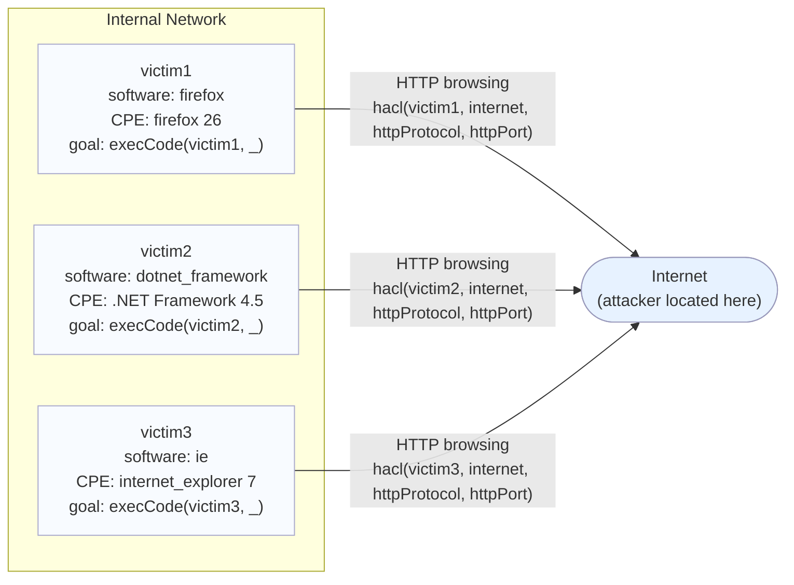

# Scenario 1 Topology

| Element | Meaning |
|---|---|
| Internet | External attacker location |
| victim1..3 | End-user hosts |
| Outgoing HTTP link | Host can access malicious content on the internet |
| Attack goal | Desired MulVAL end state |
