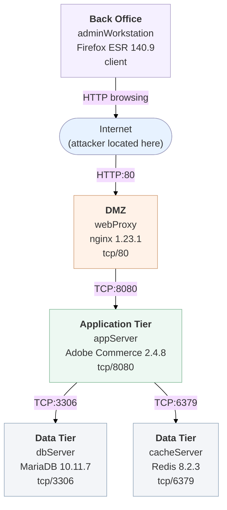

# Scenario 2 Topology — E-commerce Application (Magento)

A medium, multi-tier e-commerce deployment. An internet-facing nginx reverse
proxy fronts a Magento (Adobe Commerce) storefront, which is backed by a MariaDB
database and a Redis cache. A back-office admin workstation browses out to the
internet.

| Element | Meaning |
|---|---|
| Internet | External attacker location |
| webProxy | Internet-facing nginx reverse proxy (DMZ) |
| appServer | Magento (Adobe Commerce) storefront application |
| dbServer | MariaDB backend database |
| cacheServer | Redis session / cache store |
| adminWorkstation | Back-office admin host (client-side browsing) |
| Directed link | Allowed network reachability (`hacl`) |
| Attack goal | Desired MulVAL end state (`execCode`) |

## Attack path summary

1. The attacker reaches `webProxy` from the internet and exploits the nginx
   service (server-side, `remoteExploit`) to gain code execution.
2. From `webProxy` the attacker pivots to `appServer` and exploits Magento.
3. From `appServer` the attacker reaches the `dbServer` (MariaDB) and
   `cacheServer` (Redis) backends.
4. In parallel, the `adminWorkstation` browses malicious content and its
   vulnerable browser is exploited (client-side, `remoteClient`).
