# Scenario 3

This scenario models a larger, multi-tier hospital information system. An internet-facing HAProxy load balancer terminates TLS and fronts an Apache Tomcat patient portal, which calls an Eclipse Jetty REST API backed by a Keycloak identity provider, a PostgreSQL records database, a Memcached cache, and a RabbitMQ HL7 broker, with a back-office clinician workstation reading external email.

- `reverseProxy` runs `haproxy`
- `portalServer` runs `tomcat`
- `apiServer` runs `jetty`
- `authServer` runs `keycloak`
- `dbServer` runs `postgresql`
- `cacheServer` runs `memcached`
- `mqServer` runs `rabbitmq`
- `clinicianWorkstation` uses `thunderbird`

The idea is to start from a simple MulVAL scenario, enrich it with vulnerability data from CPE to CVE correlation, add optional STRIDE threat-model facts, and then generate an attack graph.

## Topology

## Folders

### `enviroment/`

This folder contains the scenario inputs and the generated scenario files.

- `scenario3MV.P`: the base MulVAL scenario written by hand
- `asset_cpe_mapping.json`: maps each asset to its software CPE
- `stride_definition.json`: optional STRIDE threat model for the scenario
- `scenario.P`: generated final scenario used as MulVAL input after correlation
- `registry/`: archived older versions of generated `scenario.P`

### `gen_graph/`

This folder contains files produced by MulVAL when the attack graph is generated.

- `AttackGraph.*`: graph outputs in different formats such as PDF, XML, DOT, and TXT
- `VERTICES.CSV` and `ARCS.CSV`: graph nodes and edges in CSV format

### `post_processing/`

This folder is used for any files created after MulVAL generation, such as processed graph outputs or annotations.
