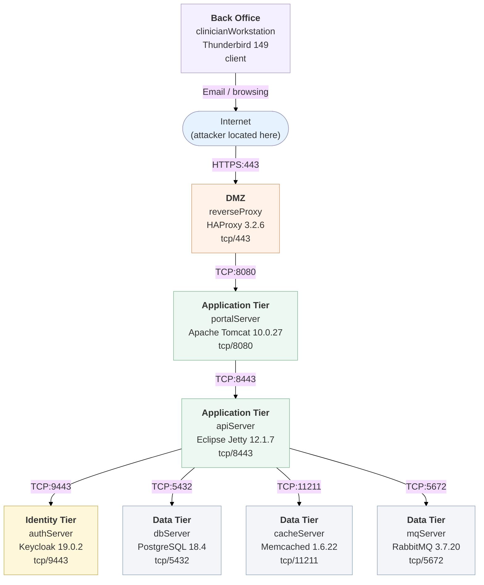

# Scenario 3 Topology — Enterprise Healthcare Patient Portal (HIS)

A larger, multi-tier hospital information system. An internet-facing HAProxy load
balancer terminates TLS and fronts an Apache Tomcat patient portal. The portal
calls an Eclipse Jetty REST API, which authenticates against a Keycloak identity
provider and is backed by a PostgreSQL records database, a Memcached session
cache and a RabbitMQ HL7 message broker. A back-office clinician workstation
reads external email.

| Element | Meaning |
|---|---|
| Internet | External attacker location |
| reverseProxy | Internet-facing HAProxy load balancer / TLS terminator (DMZ) |
| portalServer | Apache Tomcat patient-portal web application |
| apiServer | Eclipse Jetty REST API back-end |
| authServer | Keycloak single sign-on / identity provider |
| dbServer | PostgreSQL patient-records database |
| cacheServer | Memcached session / lookup cache |
| mqServer | RabbitMQ HL7 / clinical-event message broker |
| clinicianWorkstation | Back-office clinician host (email client) |
| Directed link | Allowed network reachability (`hacl`) |
| Attack goal | Desired MulVAL end state (`execCode`) |

## Attack path summary

1. The attacker reaches `reverseProxy` from the internet and exploits the HAProxy
   service (server-side, `remoteExploit`) to gain code execution in the DMZ.
2. From `reverseProxy` the attacker pivots to `portalServer` (Tomcat) and then to
   the `apiServer` (Jetty) REST back-end.
3. From `apiServer` the attacker fans out to the identity and data tiers:
   `authServer` (Keycloak), `dbServer` (PostgreSQL), `cacheServer` (Memcached)
   and `mqServer` (RabbitMQ).
4. In parallel, the `clinicianWorkstation` opens a malicious email attachment and
   its vulnerable mail client is exploited (client-side, `remoteClient`).
