# Threat Intelligence Ingestion

Synchronizes threat intelligence data from multiple authoritative sources into a PostgreSQL database.

## Architecture



## What It Does

This service aggregates vulnerability data from three critical sources:

- **NVD CVEs** - Vulnerability records with CVSS scores and affected product configurations (CPEs) via VulnCheck API
- **EPSS Scores** - Exploit prediction scores for vulnerability prioritization from First.org
- **KEV Catalog** - CISA's Known Exploited Vulnerabilities catalog via VulnCheck API

## How It Works

The service operates through sequential data synchronization:

1. **CVE Synchronization** - Downloads NVD CVE data from VulnCheck, extracts CVSS metrics and CPE mappings, and bulk inserts into PostgreSQL using batch processing.
2. **EPSS Synchronization** - Fetches compressed EPSS scores from First.org, parses CSV data, and updates the database with current exploit prediction scores
3. **KEV Synchronization** - Retrieves CISA's KEV catalog from VulnCheck, validates exploitation data, and stores actively exploited vulnerabilities

### Architecture

- **ThreatIntelligenceController** - Orchestrates sequential synchronization
- **Handlers** - Source-specific data fetching and transformation
- **PostgresRepository** - Context-managed database operations with bulk insert optimization
- **Schemas** - SQLAlchemy ORM models for database tables

## Usage

```sh
poetry run python -m threat_intelligence_connector --config .config/config.toml
```

Requires a TOML configuration file with database credentials and VulnCheck API token.

